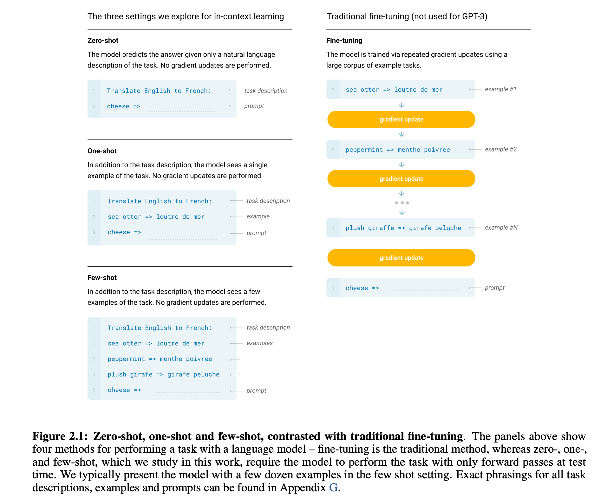

# PicoGPT / 60 行 NumPy 实现 GPT
PicoGPT is an unnecessarily tiny and minimal implementation of [GPT-2](https://d4mucfpksywv.cloudfront.net/better-language-models/language_models_are_unsupervised_multitask_learners.pdf) in plain [NumPy](https://numpy.org). The entire forward pass code is [40 lines of code](https://github.com/jaymody/picoGPT/blob/main/gpt2_pico.py#L3-L41).

> This project is forked from [jaymody/picoGPT](https://github.com/jaymody/picoGPT). 
>
> The article content is translated and edited from  [GPT in 60 Lines of Numpy](https://jaykmody.com/blog/gpt-from-scratch/).

## Dependencies

```bash
pip install -r requirements.txt
```
Tested on `Python 3.9.10`.

## Usage

```bash
python gpt2.py "Alan Turing theorized that computers would one day become"
```

Which generates:

```
the most powerful machines on the planet.

The computer is a machine that can perform complex calculations, and it can perform these calculations in a way that is very similar to the human brain.
```

You can also control the number of tokens to generate, the model size (one of `["124M", "355M", "774M", "1558M"]`), and the directory to save the models:

```bash
python gpt2.py \
    "Alan Turing theorized that computers would one day become" \
    --n_tokens_to_generate 40 \
    --model_size "124M" \
    --models_dir "models"
```


# 前言

在本文中，我们将用 60 行代码实现一个 GPT，结合 OpenAI 发布的经过训练的 GPT-2 模型权，生成一些文本。

- 本文假定读者熟悉 Python，Numpy，还有一些训练神经网络的基本经验。
- 此实现是以教育为目的，它故意缺少许多功能，以尽可能简单的同时保持完整性。

# GPT 是什么?

**GPT(Generative Pre-trained Transformer)**，是一类基于 Transformer 的神经网络架构：

- **生成式(Generative)**：GPT 可以生成文本；
- **预训练(Pre-trained)**：GPT 基于来自于书本、互联网等的海量文本进行训练；
- **Transformer**：GPT是一个只用“解码器”(decoder-only)的 Transformer 神经网络结构。

> Transformer 原本有“编码器”和“解码器”两部分，编码器负责理解输入，解码器负责生成输出。GPT 只保留了解码器部分，所以叫“decoder-only”。

像 OpenAI 的 GPT-3 这样的大型语言模型 (LLM, Large Language Models)的的底层都是 GPT。它们的特殊之处在于：经过大量数据的训练、规模非常大：

1. [OpenAI GPT-3](https://huggingface.co/papers/2005.14165)：参数量约 1750 亿(175B)，训练数据约 3000 亿个 token，数据量 45TB 左右；
2. [Google LaMDA](https://huggingface.co/papers/2201.08239)：LaMDA 1 代约 1370 亿(137B)，在预训练阶段收集并创建了一个具有 1.56T 单词的数据集。

## 输入和输入

一个 GPT 的函数签名类似这样：

```python
def gpt(inputs: list[int]) -> list[list[float]]:
    #
    # inputs 的形状是 [n_seq]
    # [n_seq] 表示这是一个一维数组，长度为 n_seq
    # 在 NLP 里，通常表示一个序列(比如一句话里有多少个 token)
    #
    # output 的形状是 [n_seq, n_vocab]
    # 表示这是一个二维数组，有 n_seq 行、 n_vocab 列
    # 在 NLP 里，通常表示每个 token 的输出是一个长度为 n_vocab 的向量，比如每个 token 预测词表中每个词的概率
    #
    output = # 神经网络的神奇魔法
    return output
```

输入是一些文本，这些文本被表示成一串整数序列，每个整数都与文本中的 token 对应：

```python
# 整数表示文本中的 token，例如：
# text  = "not all heroes wear capes"
# token = "not" "all" "heroes" "wear" "capes"
inputs =    [1,    0,       2,     4,      6]
```

token 是文本的小片段，它们由某种**分词器(Tokenizer)**产生。我们可以通过一个**词表(Vocabulary)**将 token 映射为整数：

```python
# 词表中每个 token 的 index 就是该 token 的整数 id
# 例如 "heroes" 的 index 是 2，因为 vocab[2] = "heroes"
vocab = ["all", "not", "heroes", "the", "wear", ".", "capes"]

# 一个假想的分词器，按空格进行分词
tokenizer = WhitespaceTokenizer(vocab)

# encode() 方法将字符串转换为整数列表
ids = tokenizer.encode("not all heroes wear") # ids = [1, 0, 2, 4]

# 可以通过词表映射查看实际的 token
tokens = [tokenizer.vocab[i] for i in ids] # tokens = ["not", "all", "heroes", "wear"]

# decode() 方法将整数列表转换回字符串
text = tokenizer.decode(ids) # text = "not all heroes wear"
```

简单说：我们有一个字符串、我们使用分词器将其拆解为小片段—— token、我们使用词汇表将这些 token 映射为整数。

在实际中，我们会使用一些更高级的分词器，如 [Byte-Pair Encoding](https://huggingface.co/learn/llm-course/chapter6/5) 或者 [WordPiece](https://huggingface.co/learn/llm-course/chapter6/6?fw=pt) 等，其原理是一致的：

1. 有一个 `vocab` 将字符串标记映射到整数索引；
2. 有一种 `encode` 方法可以转换 `str -> list[int]`；
3. 有一种 `decode` 方法可以转换 `list[int] -> str`。

输出是一个二维数组，其中 `output[i][j]` 表示模型的预测概率，这个概率代表了词汇表中位于 `vocab[j]` 的 token 是下一个 token `inputs[i+1]` 的概率，如：

```python
vocab = ["all", "not", "heroes", "the", "wear", ".", "capes"]
inputs = [1, 0, 2, 4] # "not" "all" "heroes" "wear"
output = gpt(inputs)

#              ["all", "not", "heroes", "the", "wear", ".", "capes"]
# output[0] =  [0.75    0.1       0.0   0.15     0.0  0.0      0.0 ]
# 只给定 "not"，模型预测下一个词是 "all" 的概率最大

#              ["all", "not", "heroes", "the", "wear", ".", "capes"]
# output[1] =  [ 0.0    0.0       0.8    0.1     0.0   0.0     0.1 ]
# 给定序列 ["not", "all"]，模型预测下一个词是 "heroes" 的概率最大

#              ["all", "not", "heroes", "the", "wear", ".", "capes"]
# output[-1] = [ 0.0    0.0       0.0    0.1     0.0 0.05     0.85 ]
# 给定整个序列 ["not", "all", "heroes", "wear"]，模型预测下一个词是 "capes" 的概率最大
```

为了获得整个序列的下一个 token 预测，我们只需取概率最高的标记  `output[-1]`：

```python
vocab = ["all", "not", "heroes", "the", "wear", ".", "capes"]
inputs = [1, 0, 2, 4] # "not" "all" "heroes" "wear"
output = gpt(inputs)
next_token_id = np.argmax(output[-1]) # next_token_id = 6
next_token = vocab[next_token_id]     # next_token = "capes"
```

将具有最高概率的 token 作为结果，叫做**[贪婪解码(Greedy decoding)](https://docs.cohere.com/docs/controlling-generation-with-top-k-top-p#1-pick-the-top-token-greedy-decoding)**或者**贪婪采样(Greedy sampling)**。

预测序列中下一个最合理单词的任务被称为**语言建模(Language modeling)**，我们可以把 GPT 称为一种**语言模型(Language model)**。

## 生成文本

### 自回归(Autoregressive)

我们可以迭代地从模型中获取下一个 token 来生成完整的句子。在每次迭代中，我们将预测的 token 添加回输入：

```python
def generate(inputs, n_tokens_to_generate):
    for _ in range(n_tokens_to_generate): # 自回归 decode 循环
        output = gpt(inputs)              # 模型推理
        next_id = np.argmax(output[-1])   # 贪婪采样
        inputs.append(int(next_id))       # 将预测结果添加回输入
    return inputs[len(inputs) - n_tokens_to_generate :]  # 只返回生成的 token id

input_ids = [1, 0]                             # "not" "all"
output_ids = generate(input_ids, 3)            # output_ids = [2, 4, 6]
output_tokens = [vocab[i] for i in output_ids] # "heroes" "wear" "capes"
```

预测未来值(Regression)并将其添加回输入(auto)的过程就是 GPT 被描述为**自回归(Autoregressive)**的原因。

### 采样(Sampling)

我们可以通过按照概率分布随机选择一个 token 来引入一些**随机性(Stochasticity)**：

```python
inputs = [1, 0, 2, 4] # "not" "all" "heroes" "wear"
output = gpt(inputs)
np.random.choice(np.arange(vocab_size), p=output[-1]) # capes
np.random.choice(np.arange(vocab_size), p=output[-1]) # hats
np.random.choice(np.arange(vocab_size), p=output[-1]) # capes
np.random.choice(np.arange(vocab_size), p=output[-1]) # capes
np.random.choice(np.arange(vocab_size), p=output[-1]) # pants
```

这使我们能够针对相同的输入生成不同的句子。当与 [**top-k**](https://docs.cohere.ai/docs/controlling-generation-with-top-k-top-p#2-pick-from-amongst-the-top-tokens-top-k)、[**top-p**](https://docs.cohere.ai/docs/controlling-generation-with-top-k-top-p#3-pick-from-amongst-the-top-tokens-whose-probabilities-add-up-to-15-top-p) 和 [**temperature **](https://docs.cohere.ai/docs/temperature)等在采样前修改分布的技术结合使用时，我们的输出质量将得到显著提升。这些技术还引入了一些**超参数(Hyperparameter)**，这些超参数由开发者在训练开始前手动设定的参数，而不是通过模型自动学习得到的参数。我们可以尝试调整这些超参数来获得不同的生成行为。

> 1. top-k ：每次只在概率最高的前 k 个词里随机选一个，增加多样性，避免总是选概率最大的词。
> 2. top-p ：每次只在累计概率达到 p 的词集合里随机选一个，动态控制候选词数量，进一步提升生成的自然度和多样性。
> 3. temperature ：通过调整概率分布的“平滑度”，温度高时生成更随机，温度低时生成更确定。

## 训练(Training)

我们与训练其它神经网络一样，**损失函数(Loss Function)**是衡量模型预测结果与真实结果之间差距的一个函数，针对特定的损失函数，使用[梯度下降(Gradient descent optimization algorithms)](https://huggingface.co/papers/1609.04747)训练 GPT，即根据损失函数对参数的导数(梯度)，沿着让损失变小的方向，微调模型参数。

在这里，我们使用**语言建模任务(Language Modeling)**即给定一段文本的前面部分，预测下一个最有可能出现的 token 的任务的[**交叉熵损失(Cross Entropy Loss)**](https://www.youtube.com/watch?v=ErfnhcEV1O8)损失函数：假设有三个类别，真实标签是类别 2，模型预测概率为 [0.1, 0.7, 0.2]，那么交叉熵损失就是 -log(0.7)。如果模型预测概率为 [0.1, 0.2, 0.7]，损失就是 -log(0.2)，显然损失更大，因为模型预测错了。具体可见代码：

```python
def lm_loss(inputs: list[int], params) -> float:
    # 标签 y 只是 inputs 向左移动 1 位
    # 
    # inputs = [not, all, heroes, wear, capes]
    #      x = [not, all, heroes, wear]
    #      y =      [all, heroes, wear, capes]
    # 
    # 对于长度为 N 的 inputs，我们可以构建 N-1 个"输入-标签"对
    # 两者的形状都是 [序列中的 token 数 - 1]
    x, y = inputs[:-1], inputs[1:] 
    
    # 前向传播(Forward pass): 把输入数据依次通过神经网络的每一层，最终得到输出。
    #
    # 在每个位置预测的下一个 token 的概率分布
    output = gpt(x, params) # 形状为 [序列中的 token 数 - 1, 词表中的 token 数]
    
    # 交叉熵损失
    # 我们对所有 N-1 个示例取平均值
    # 对于二维数组 output ，在第 i 行，取第 y[i] 列的元素
    # 最终得到的是一个一维数组，长度等于行数，每个元素就是模型在该位置预测真实下一个 token 的概率
    loss = np.mean(-np.log(output[np.arange(len(output)), y]))
    
    return loss

def train(texts: list[list[str]], params) -> float:
    for text in texts:
      	#
      	# 用 tokenizer.encode(text) 把文本转成 token id 的序列，方便模型处理
        inputs = tokenizer.encode(text)
        #
        # 计算当前模型在这条数据上的损失，衡量模型预测和真实答案的差距
        loss = lm_loss(inputs, params)
        #
        # 反向传播算法(backpropagation): 根据损失函数的结果，自动计算每个参数对损失的影响,用于指导参数如何调整
        #
        # 通过反向传播算法计算损失对参数的梯度，即每个参数该怎么调整能让损失变小
        gradients = compute_gradients_via_backpropagation(loss, params)
        #
        # 根据梯度调整参数，即“优化”模型，让模型表现更好
        params = gradient_descent_update_step(gradients, params)
    #
    # 所有文本都训练一遍后，返回更新后的参数
    return params
```

这就是一个极度简化但典型的神经网络训练循环：编码输入、计算损失、反向传播求梯度、用梯度下降法更新参数。不断重复这个过程，模型就会越来越“聪明”，预测能力越来越强。

请注意，我们在这里并未使用明确的标注数据。取而代之的是使用原始文本自身，产生大量的输入/标签对(input/label pairs)。这就是所谓的**[自监督学习(Self-supervised learning)](https://en.wikipedia.org/wiki/Self-supervised_learning)**。自监督使我们能够大规模扩展训练数据。我们只需要获取尽可能多的原始文本，并将其输入到模型中即可。例如，GPT-3 使用了来自互联网和书籍的 3000 亿个文本 tokens 进行训练，以下图表来自[Language Models are Few-Shot Learners](https://huggingface.co/papers/2005.14165)：


这个自监督训练的步骤称之为**预训练(Pre-training)**，我们可以重复使用预训练模型权重来训练下游任务上的特定模型，预训练模型有时也被称为**基础模型(Foundation models)**。在下游任务上训练模型被称之为**微调(Fine-tuning)**，因为模型权重已经过预先训练以理解语言，因此它只是针对手头的特定任务进行微调。这种“在通用任务上预训练+在特定任务上微调”的策略，称之为**[迁移学习(Transfer learning)](https://en.wikipedia.org/wiki/Transfer_learning)**。

## 提示(Prompting)

最初的 [Improving Language Understanding by Generative Pre-Training](https://cdn.openai.com/research-covers/language-unsupervised/language_understanding_paper.pdf) (GPT-1)介绍了一种使用 Transformer 架构的生成式预训练模型，提出了一种两阶段训练方法：首先在大量无标注文本上进行预训练、然后在有标注数据上进行微调。一个 117M 参数规模的 GPT 预训练模型，在针对下游任务的标注数据上微调之后，它能够在各种**自然语言处理(NLP, Natural language processing)**任务上达到最优性能。

直到 [Language Models are Unsupervised Multitask Learners ](https://cdn.openai.com/better-language-models/language_models_are_unsupervised_multitask_learners.pdf)和 [Language Models are Few-Shot Learners](https://arxiv.org/abs/2005.14165) (GPT-2/GPT-3)论文发表，我们意识到，一个用足够多的数据和参数预训练的 GPT 模型，能够独立执行任意任务，无需微调，模型具备了**涌现能力(Emergent abilities)**。只要对模型进行**提示(Prompt)**，模型就会给出合适的响应。这被称为**上下文学习(In-context learning)**，因为模型仅使用提示的上下文来执行任务。上下文学习可以是**零样本学习(Zero-shot)**、**单样本学习(One-shot)**或**少样本学习(Few-shot)**：



基于提示内容生成文本也被称之为**条件生成(Conditional generation)**，因为我们的模型是基于特定的输入(条件)进行内容生成的。

GPT 不仅限于自然语言处理任务(NLP)，它可以应用于各种条件下的场景。你可以将模型用于任何你想要的条件下。你可以将 GPT 变成一个聊天机器人，这种情况下，模型的条件就是你的对话历史。模型会根据之前的对话内容来生成合适的回复。通过合理设计提示词，可以在很大程度上控制模型的输出行为，但同时也需要注意其潜在的局限性。

# 实现 GPT

## 下载和了解项目

克隆本教程的存储库，并安装依赖项：

```
git clone https://github.com/LLLLLayer/PicoGPT.git
cd picoGPT
pip install -r requirements.txt
```

项目文件包含：

- **`encoder.py`** 包含 OpenAI 的 BPE(Byte Pair Encoding)分词器(Tokenizer)的代码，来自 [openai gpt-2](https://github.com/openai/gpt-2/blob/master/src/encoder.py)；
- **`utils.py`** 包含下载和加载 GPT-2 模型的权重、分词器和超参数的代码；
- **`gpt2.py`** 包含实际的 GPT 模型的代码及完整的注释描述，可直接运行；
- **`gpt2_pico.py `**与 `gpt2.py` 相同，但省去了注释部分。

首先

```python
import numpy as np

def gpt2(inputs, wte, wpe, blocks, ln_f, n_head):
    pass # TODO: 待实现

def generate(inputs, params, n_head, n_tokens_to_generate):
    from tqdm import tqdm
    # 自回归解码循环
    for _ in tqdm(range(n_tokens_to_generate), "generating"): 
        logits = gpt2(inputs, **params, n_head=n_head)  # 模型前向传播
        next_id = np.argmax(logits[-1])                 # 贪婪采样
        inputs.append(int(next_id))                     # 将预测结果添加到输入中

    return inputs[len(inputs) - n_tokens_to_generate :] # 只返回生成的 id

def main(prompt: str, n_tokens_to_generate: int = 40, model_size: str = "124M", models_dir: str = "models"):
    from utils import load_encoder_hparams_and_params
    # 从 openai gpt-2 文件中加载编码器、超参数和参数
    encoder, hparams, params = load_encoder_hparams_and_params(model_size, models_dir)

    # 使用 BPE 分词器对输入字符串进行编码
    input_ids = encoder.encode(prompt)

    # 确保我们不超过模型的最大序列长度
    assert len(input_ids) + n_tokens_to_generate < hparams["n_ctx"]

    # 生成输出 token
    output_ids = generate(input_ids, params, hparams["n_head"], n_tokens_to_generate)

    # 将 token 解码回字符串
    output_text = encoder.decode(output_ids)

    return output_text

if __name__ == "__main__":
    import fire
    fire.Fire(main)
```

上述代码包含四个部分：

1. `gpt2` 函数是我们将要实现的 GPT。函数签名中除了 `inputs`，还有其它的参数：

   - `wte`、`wpe`、 `blocks`、 `ln_f` 是模型的参数；
   - `n_head` 是前向传播过程中需要的超参数；

2. `generate` 函数是自回归解码，为了简洁，这里将使用贪婪解码；

   - [`tqdm`](https://github.com/tqdm/tqdm) 提供进度，以直观地看到解码过程；

3. `main` 函数：

   1. 加载分词器(`encoder`)、模型权重(`params`)、超参数(`hparams`)；

      ```python
      # 这将下载必要的文件到 models/124M 中
      from utils import load_encoder_hparams_and_params
      encoder, hparams, params = load_encoder_hparams_and_params("124M", "models")
      ```

      > 在很多NLP库中，"encoder" 这个术语有时会用来指代包含 tokenization 功能的对象.
      >
      > 在示例的代码中，encoder 对象实际上是一个tokenizer，它包含:
      >
      > - encode 方法：将文本转换为token ID(tokenizer功能)；
      > - decoder 属性：将 token ID 映射回文本表示。

   2. 使用 BPE 分词器对输入字符串进行编码；

   3. 调用 `generate` 函数生成输出 token；

   4. 将 token 解码回字符串以输出；

4. [`fire.Fire(main)`](https://github.com/google/python-fire) 让文件变成 CLI 应用程序，最终可以使用命令运行代码：`python gpt2.py "some prompt here"`。

## 分词器、超参数、参数

`encoder` 是 GPT-2 使用的 BPE 分词器：

```python
ids = encoder.encode("Not all heroes wear capes.")
ids
# [3673, 477, 10281, 5806, 1451, 274, 13]
```

使用分词器的词汇表，可以查看实际的 token：

```python
[encoder.decoder[i] for i in ids]
# ['Not', 'Ġall', 'Ġheroes', 'Ġwear', 'Ġcap', 'es', '.']
```

请注意，有时 token 是单词(如 `Not`)，有时是前面有一个空格的单词(如 `Ġall`，[`Ġ`表示空格](https://github.com/karpathy/minGPT/blob/37baab71b9abea1b76ab957409a1cc2fbfba8a26/mingpt/bpe.py#L22-L33))，有时是部分单词(如 capes 分为  `Ġcap` 和  `es`)，有时是标点符号(如 `.`)。

 BPE 的一个优点是它可以编码任意字符串，若遇到词汇表中不存在的内容，它会将其分解为它能理解的子字符串：

```python
[encoder.decoder[i] for i in encoder.encode("zjqfl")]
# ['z', 'j', 'q', 'fl']
```

**词汇表(Vocabulary)**和**字节对组合(Byte-pair merges)**是现代自然语言处理中**分词器(Tokenizer)**的核心组成部分。

词汇表就像是一本"字典"，它包含了模型能够理解的所有"单词"(tokens)及其对应的数字 ID。在 GPT 模型中，这些"单词"可能是真实的单词、单个字符、或者是常见的词组片段。

**字节对编码(BPE，Byte-Pair Encoding)** 是一种决定如何将文本分解成 token 的算法。它首先将文本看作单个字符，然后逐步合并最常一起出现的字符对，形成新的 token，这个过程不断重复，直到达到预设的词汇量。假设"机器学习"这个词在语料库中经常出现BPE算法可能会将其作为一个完整的 token，而不是分解为"机"、"器"、"学"、"习"四个 token 这样可以更高效地表示常见词组。

> 这些文件在运行 `load_encoder_hparams_and_params`时被下载。
>
> 可以查看 `models/124M/encoder.json` (词汇表)和 `models/124M/vocab.bpe` (字节对组合)。

**超参数(Hyperparameters)**是在模型训练开始前设置的参数，它们控制模型的结构和训练过程。`hparams` 是一个包含我们模型超参数的字典：

```python
hparams
{ 
   "n_vocab": 50257, # 词表中的 token 数量
  									 #
   "n_ctx"  : 1024,  # 输入的最大可能序列长度
  									 #
   "n_embd" : 768,   # 嵌入维度
  									 # 表示每个 token 被转换成的向量维度，决定网络的"宽度"；维度越大，向量能够编码的信息越丰富；
  									 # 更高的维度使模型能够更好地区分不同 token 之间的细微差别，维度也使模型能够捕捉更复杂的语义关系。
  									 #
   "n_head" : 12,    # 注意力头的数量
  									 # 它决定了模型如何并行处理和整合不同角度的信息，对模型的性能有重要影响；可以理解为模型观察输入序列的不同"视角"或"焦点"；
  								   # 每个头都会独立地计算注意力权重、关注输入序列的不同方面、捕捉不同类型的依赖关系。
  									 #
   "n_layer": 12     # 层数
  									 # 表示 Transformer 块的堆叠数量，决定网络的"深度"；层数越多，信息可以传递的路径就越多样化
  									 # 多的层使模型能够学习更抽象、更复杂的特征，低层通常捕获基本语法和简单语义、高层能够理解更复杂的语义关系和上下文。
}
# n_layer(层数)：决定深度
# n_embd(嵌入维度)：决定宽度
# n_head(注意力头数)：决定并行处理能力
```

此外， 我们会使用  `n_seq` (Number of sequence)表示输入序列的长度，即 `n_seq = len(inputs)`。

`params` 是一个嵌套的  JSON 字典，用于保存模型的训练权重。JSON 的叶节点是 NumPy 数组。如果打印  `params`，并将数组替换为其形状，我们将得到：

```python
import numpy as np
def shape_tree(d):
    if isinstance(d, np.ndarray):
        return list(d.shape)
    elif isinstance(d, list):
        return [shape_tree(v) for v in d]
    elif isinstance(d, dict):
        return {k: shape_tree(v) for k, v in d.items()}
    else:
        ValueError("uh oh")

print(shape_tree(params))
# {
#     "wpe": [ 1024, 768],                      # 位置嵌入权重(wpe)，为序列中的每个位置提供位置信息
#     "wte": [50257, 768],                      # 词嵌入权重(wte)，将输入 token ID 转换为向量表示
#     "ln_f": {"b": [768], "g": [768]},         # 最终层归一化参数(ln_f)，对最终输出进行归一化处理
#     "blocks": [                               # Transformer 块(blocks)，包含多个相同结构的层，每层包含:
#         {
#             "attn": {                         # 注意力机制(attn)
#                 "c_attn": {"b": [2304], "w": [768, 2304]},
#                 "c_proj": {"b":  [768], "w": [768,  768]},
#             },
#             "ln_1": {"b": [768], "g": [768]}, # 层归一化(ln_1, ln_2)
#             "ln_2": {"b": [768], "g": [768]},
#             "mlp": {                          # 多层感知机(mlp)
#                 "c_fc"  : {"b": [3072], "w": [ 768, 3072]},
#                 "c_proj": {"b":  [768], "w": [3072,  768]},
#             },
#         },
#         ... # repeat for n_layers
#     ]
# }
```

为了对比，这里显示了 `params` 的形状：

```python
{
    "wpe": [  n_ctx, n_embd],
    "wte": [n_vocab, n_embd],
    "ln_f": {"b": [n_embd], "g": [n_embd]},
    "blocks": [
        {
            "attn": {
                "c_attn": {"b": [3*n_embd], "w": [n_embd, 3*n_embd]},
                "c_proj": {"b": [  n_embd], "w": [n_embd,   n_embd]},
            },
            "ln_1": {"b": [n_embd], "g": [n_embd]},
            "ln_2": {"b": [n_embd], "g": [n_embd]},
            "mlp": {
                "c_fc"  : {"b": [4*n_embd], "w": [  n_embd, 4*n_embd]},
                "c_proj": {"b": [  n_embd], "w": [4*n_embd,   n_embd]},
            },
        },
        ... # repeat for n_layers
    ]
}
```

这些是从 OpenAI TensorFlow 检查点加载的：

```python
import tensorflow as tf
tf_ckpt_path = tf.train.latest_checkpoint("models/124M")
for name, _ in tf.train.list_variables(tf_ckpt_path):
    arr = tf.train.load_variable(tf_ckpt_path, name).squeeze()
    print(f"{name}: {arr.shape}")
# model/h0/attn/c_attn/b: (2304,)
# model/h0/attn/c_attn/w: (768, 2304)
# model/h0/attn/c_proj/b: (768,)
# model/h0/attn/c_proj/w: (768, 768)
# model/h0/ln_1/b: (768,)
# model/h0/ln_1/g: (768,)
# model/h0/ln_2/b: (768,)
# model/h0/ln_2/g: (768,)
# model/h0/mlp/c_fc/b: (3072,)
# model/h0/mlp/c_fc/w: (768, 3072)
# model/h0/mlp/c_proj/b: (768,)
# model/h0/mlp/c_proj/w: (3072, 768)
# model/h1/attn/c_attn/b: (2304,)
# model/h1/attn/c_attn/w: (768, 2304)
...
# model/h9/mlp/c_proj/b: (768,)
# model/h9/mlp/c_proj/w: (3072, 768)
# model/ln_f/b: (768,)
# model/ln_f/g: (768,)
# model/wpe: (1024, 768)
# model/wte: (50257, 768)
```

在实现 GPT 时，我们需要回来参考该字典来检查权重的形状。为了保持一致性，我们会将代码中的变量名与字典的键进行匹配。

## 基础的神经网络层

在深入了解 GPT 架构本身之前，我们需要先实现一些基础的神经网络层，这些并不是 GPT 特有的。

### 高斯误差线性单元(GELU)

[GELU (Gaussian Error Linear Units)](https://huggingface.co/papers/1606.08415) 是 GPT-2 的非线性激活函数，在 Transformer 架构中表现优于 ReLU 和其他激活函数。神经网络中最基本的操作是线性变换(如矩阵乘法和偏置加法)。如果没有非线性激活函数，无论神经网络有多少层，整个网络本质上仍然只是一个线性模型。非线性激活函数打破了这种限制，使网络能够学习复杂的非线性关系。


GELU 激活函数 `GELU(x) = x * Φ(x)` 可以被理解为：将输入值 x 乘以该输入被保留的概率。这个概率由标准正态分布的累积分布函数(CDF)给出。由于标准正态分布的 CDF 计算复杂，代码使用了一个常用的近似公式：

```python
def gelu(x):
  	return 0.5 * x * (1 + np.tanh(np.sqrt(2 / np.pi) * (x + 0.044715 * x**3)))
```

GELU 对输入进行逐元素操作：

```python
gelu(np.array([[1, 2], [-2, 0.5]]))
# array([[ 0.84119,  1.9546],
#        [ -0.0454, 0.34571]])
```

> 在后文的实现中，GELU 主要用在前馈神经网络部分。

### 软最大值函数(Softmax)

Softmax 函数在神经网络和深度学习中扮演着非常重要的角色，Softmax 的核心作用是将一组实数值(通常称为 logits)转换为概率分布。它确保所有输出值在 0 到 1 之间，并且所有值的总和为 1。在 GPT-2 等语言模型中，Softmax 用于词汇表上的概率分布，帮助模型预测序列中的下一个词。下面是最经典的 Softmax 函数(整个表达式计算的是第 i 个元素的概率值):
$$
\text{softmax}(x_i) = \frac{e^{x_i}}{\sum_j e^{x_j}}
$$

```python
def softmax(x):
    exp_x = np.exp(x - np.max(x, axis=-1, keepdims=True))
    # 首先从输入 x 中减去每个样本的最大值(最大的输入值变为 0，其他值变为负数)，防止指数计算时出现数值溢出
    # 对调整后的值计算指数 `exp_x = np.exp(x - max_x)`，这将所有值转换为正数
    # axis=-1 表示沿着最后一个维度操作，对于 GPT-2 模型的输出 logits，最后一个维度的大小等于词汇表大小
    # keepdims=True 保持数组的维度结构，便于后续操作
    return exp_x / np.sum(exp_x, axis=-1, keepdims=True)
    # 计算指数值的总和，将每个指数值除以总和，这确保输出的所有值在 0 到 1 之间，且总和为 1。
```

```python
x = softmax(np.array([[2, 100], [-5, 0]]))
x
# array([[0.00034, 0.99966],
#        [0.26894, 0.73106]])
x.sum(axis=-1)
# array([1., 1.])
```

> 在后文的实现中，Softmax 主要用于注意力机制部分。

### 层归一化(Layer Normalization)

[层归一化(Layer Normalization)](https://huggingface.co/papers/1607.06450) 是一种在深度神经网络中常用的技术，通常在神经网络的每一层应用，对每个样本的特征维度进行标准化。它的主要作用是加速网络训练过程、提高模型的稳定性、减轻内部协变量偏移(Internal covariate shift)问题、使网络对权重初始化不那么敏感等。

层归一化将数据标准化为均值为 0、方差为 1 的分布，具体步骤如下：
$$
LayerNorm(x) = \gamma \cdot \frac{x - \mu}{\sqrt{\sigma^2}} + \beta
$$

```python
def layer_norm(x, g, b, eps: float = 1e-5):
    mean = np.mean(x, axis=-1, keepdims=True)    # 对输入张量 x 在最后一个维度(通常是特征维度)上计算均值
    variance = np.var(x, axis=-1, keepdims=True) # 同样在最后一个维度上计算方差
    x = (x - mean) / np.sqrt(variance + eps)     # 将输入减去均值并除以标准差，实现标准化
    																				     # eps 是一个小常数(默认为1e-5)，用于数值稳定性，防止除以零。
    return g * x + b # 使用可学习的参数 g(gamma)和 b(beta)对标准化后的数据进行线性变换
  									 # 这使网络能够学习恢复数据的表示能力
```

```python
x = np.array([[2, 2, 3], [-5, 0, 1]])
x = layer_norm(x, g=np.ones(x.shape[-1]), b=np.zeros(x.shape[-1]))
x
# array([[-0.70709, -0.70709,  1.41418],
#.       [  -1.397,    0.508,    0.889]])
x.var(axis=-1)
# array([0.99996, 1.])
x.mean(axis=-1)
#array([-0., -0.])
```

> 在后文的实现中，层归一化在注意力机制和前馈网络之前都被应用。

### 线性变换(Linear)

在深度学习中，线性层通常与非线性激活函数结合使用，以增强模型的表达能力。这种维度变换是深度学习中的基础操作，使模型能够在不同维度的特征空间中进行计算和学习。线性变换是一种将向量从一个向量空间映射到另一个向量空间的操作。在深度学习中，这通常通过矩阵乘法加偏置来实现。

linear 函数实现了一个标准的线性变换，这个函数实现了一个标准的矩阵乘法加偏置的线性层，通常被称为**投影(Projection)**。这个名称来源于线性代数中的向量空间投影概念，因为它将向量从一个向量空间映射(或"投影")到另一个向量空间：

```python
def linear(x, w, b): 
  	# [m, in], [in, out], [out] -> [m, out]
    # x 是输入向量/矩阵，形状为 [m, in](m个样本，每个样本有in个特征)
    # w 是权重矩阵，形状为 [in, out](将in维输入映射到out维输出)
    # b 是偏置向量，形状为 [out](为每个输出维度添加一个偏移)
    # @ 是矩阵乘法运算符
    # 结果形状为 [m, out](m个样本，每个样本有out个特征)
    return x @ w + b
```

```python
x = np.random.normal(size=(64, 784)) # 表示 64 个样本，每个样本有 784 个特征
w = np.random.normal(size=(784, 10)) # 第一个维度(784)必须匹配输入的特征维度，第二个维度(10)决定了输出的特征数量
b = np.random.normal(size=(10,))     # 长度必须匹配输出的特征数量
x.shape # 线性投影前的形状
# (64, 784)
linear(x, w, b).shape # 线性投影后的形状
# (64, 10)
```

> 在后文的实现中，线性变换在注意力机制、前馈神经网络等被应用。

## GPT 架构

GPT的架构是基于 [Transformer](https://huggingface.co/papers/1706.03762) 的，但它仅仅使用了解码器层，此外我们已经搞定了编码器，所以中间的”cross-attention”层被移除：

|  |  |
| ------------------------------------------------------------ | ------------------------------------------------------------ |

GPT 架构分为三个部分：词元嵌入 (Word Token Embeddings) + 位置嵌入(WPE)、Transformer 解码器堆栈(Decoder stack)、投影为词汇表(Projection to vocab)。在代码里如下：

```python
def gpt2(inputs, wte, wpe, blocks, ln_f, n_head):  # [n_seq] -> [n_seq, n_vocab]
  	# inputs : 输入的 token 序列，形状为 [n_seq]
		#    wte : 词元嵌入矩阵 (Word Token Embeddings)
		#    wpe : 位置嵌入矩阵 (Word Position Embeddings)
		# blocks : Transformer块的列表
		#   ln_f : 最终的层归一化参数
		# n_head : 注意力头的数量
    
    #  + 位置嵌入：将输入序列中的每个 token 转换为嵌入向量、为每个位置添加位置编码
    x = wte[inputs] + wpe[range(len(inputs))]  # 输入形状从 [n_seq] 变为 [n_seq, n_embd]

    # 通过 n 层 Transformer 块的前向传播：依次通过每个 Transformer 块、每个块保持嵌入维度不变
    for block in blocks:
        x = transformer_block(x, **block, n_head=n_head)  # 输入和输出形状都是 [n_seq, n_embd]

    # 投影到词汇表：对最终的隐藏状态应用层归一化、使用词元嵌入矩阵的转置将隐藏状态投影回词汇表空间
    x = layer_norm(x, **ln_f)  # 输入和输出形状都是 [n_seq, n_embd]
    return x @ wte.T  # 输出形状从 [n_seq, n_embd] 变为 [n_seq, n_vocab]
```

让我们更详细地分解这三个部分。

### 嵌入(Embeddings)

**词元嵌入矩阵 (Word Token Embeddings)**

Token 本身并不能很好地表征神经网络。首先，Token 的相对大小会错误地传达信息(若词汇表中有 `Apple = 5` 和 `Table = 10`，但并不意味着 `2 * Apple = Table`)。其次，单个数字对于神经网络来说维度不够高。

为了解决这些限制，我们将利用[词向量(Word vector)](https://jaykmody.com/blog/attention-intuition/#word-vectors-and-similarity)，通过学习嵌入矩阵，将离散的 token 转换为连续的向量表示：

```python
wte[inputs] # [n_seq] -> [n_seq, n_embd]
```

`wte` 是一个 `[n_vocab, n_embd]` 矩阵。它充当查找表，矩阵中的第 i 行对应词汇表中的第 i 个 token 的向量表示。`wte[inputs]` 使用整数数组索引来检索与输入中的每个 token 相对应的向量。与神经网络中的其他参数一样，`wte` 是学习而来的。它在训练开始时随机初始化，然后通过梯度下降进行更新。

这些连续的向量表示捕捉了词元的语义信息：语义相似的词元在向量空间中距离较近；向量之间可以进行数学运算，如 vec("国王") - vec("男人") + vec("女人") ≈ vec("王后")；这些向量作为模型的输入，使模型能够理解和处理自然语言。通过这种方式，GPT-2 模型将离散的、计算机易于处理的 token 转换为连续的、包含丰富语义信息的向量表示，为后续的神经网络处理奠定基础。

**位置嵌入矩阵(WPE)**

Transformer 架构的一个奇特之处在于它本身不考虑输入序列的位置信息。如果我们随机打乱输入序列中词元的顺序，模型的输出可能保持不变，这意味着输入的顺序对输出没有影响。然而，在自然语言中，词的顺序显然是至关重要的。例如，"猫追狗"和"狗追猫"表达的是完全不同的意思，尽管使用了相同的词。因此，我们需要某种方式将位置信息编码到输入中。

为了解决这个问题，GPT-2使用了一个可学习的位置嵌入矩阵：

```python
wpe[range(len(inputs))] # [n_seq] -> [n_seq, n_embd]
```

`wpe` 是一个形状为 `[n_ctx, n_embd]` 的矩阵，矩阵的第 i 行包含一个向量，用于编码输入序列中第 i 个位置的信息，与词元嵌入矩阵类似，这个位置嵌入矩阵也是通过梯度下降学习得到的。

需要注意的是，这种方法限制了模型能处理的最大序列长度为 `n_ctx` 。这意味着必须满足条件： `len(inputs) <= n_ctx`。这是因为位置嵌入矩阵 `wpe` 只包含了 `n_ctx` 个不同位置的嵌入向量。如果输入序列长度超过 `n_ctx`，模型将无法为超出部分的位置提供有效的位置编码。在 GPT-2 中， `n_ctx` 通常设置为1024，这意味着模型一次最多可以处理 1024个 token 的序列。

**组合**

在 GPT-2 模型中，输入表示是通过组合两种不同类型的嵌入来创建的：词元嵌入和位置嵌入。这段代码展示了这一关键步骤：

```python
# 词元嵌入 + 位置嵌入
x = wte[inputs] + wpe[range(len(inputs))]  # [n_seq] -> [n_seq, n_embd]
# x[i] 将两个相同形状的矩阵对应元素相加，结果 x 的形状仍为 [n_seq, n_embd]
```

对于输入序列中的第 i 个词元， x[i] 包含了该词元的语义信息和它在序列中第 i 个位置的位置信息，即使相同的词元出现在不同位置，它们的最终表示也会不同模型能够理解"猫追狗"和"狗追猫"的区别，因为虽然词元相同，但位置嵌入不同。这种组合嵌入方法是 GPT-2 等 Transformer 模型成功处理序列数据的关键技术之一。

### 解码器堆栈(Decoder Stack)

这段代码是 GPT-2 模型中最核心的部分，也是深度学习中"深度"的具体体现：

```python
# 通过 n_layer 个 Transformer 解码器块的前向传播
for block in blocks:
    x = transformer_block(x, **block, n_head=n_head)  # [n_seq, n_embd] -> [n_seq, n_embd]
```

这里的"深度"指的是神经网络中层的数量。在这个循环中，输入数据 x 依次通过多个 Transformer 解码器块，每个块都对数据进行一系列复杂的转换，然后将结果传递给下一个块。

每个 Transformer 块通常包含：多头自注意力机制、前馈神经网络、残差连接、层归一化。

堆叠更多的 Transformer 块(增加 n_layer 的值)可以：增强模型的表达能力、使模型能够学习更复杂的模式和关系、提高模型处理长距离依赖的能力。随着深度(层数)和宽度(嵌入维度)的增加，模型的参数数量和计算复杂度也会显著增加。这就是为什么大型语言模型需要强大的计算资源进行训练和推理的原因。

总之，这个简单的循环是 GPT-2 模型能力的核心所在，通过堆叠多个 Transformer 块，模型能够逐层构建对输入序列的深入理解，并最终生成高质量的文本输出。

### 词汇投影(Projection to Vocab)

词汇投影是 GPT-2 模型中的最后一个关键步骤，它将 Transformer 块的输出转换为词汇表上的概率分布：

```python
# 投影到词汇表
x = layer_norm(x, **ln_f)  # [n_seq, n_embd] -> [n_seq, n_embd]
return x @ wte.T  # [n_seq, n_embd] -> [n_seq, n_vocab]
```

其工作原理是：

1. 最终层归一化：在投影之前，首先对 Transformer 块的输出应用层归一化，这是 GPT-2 架构特有的设计(原始 GPT 和 Transformer 论文中没有)，层归一化有助于稳定深层网络的训练和推理；
2. 矩阵乘法投影：使用词元嵌入矩阵的转置(wte.T)进行投影，输入形状为 `[n_seq, n_embd]`，输出形状为 `[n_seq, n_vocab]`每个位置的输出向量包含词汇表中每个 token 的 logit 分数。

权重共享存在一定的优势：

GPT-2 重用词元嵌入矩阵(wte)进行投影，而不是使用单独的权重矩阵：

1. 参数节约：减少了模型的参数数量(虽然在GPT-3规模上这种节约可以忽略不计)

2. 更丰富的表示：同一矩阵既负责从 token 映射到嵌入空间，也负责从嵌入空间映射回 token 空间理论上，这种双向映射可以学习到比两个独立矩阵更丰富的表示。

其中，模型输出的是logits(未归一化的分数)，而不是应用softmax后的概率：

1. 贪婪采样的等效性：由于 softmax 是单调函数， `np.argmax(logits)` 等同于 `np.argmax(softmax(logits))`，对于贪婪采样来说，应用 softmax是多余的；

2. 信息保留：logits 包含更多信息，可以随时通过应用 softmax 转换为概率，但从概率无法恢复回 logits，因此输出 logits 提供了最大的灵活性；

3. 数值稳定性：在计算损失函数时(如交叉熵损失)，直接使用logits通常更稳定，`log(softmax(logits))` 可以用更稳定的 `log_softmax(logits)` 替代。

投影到词汇表的步骤有时被称为**语言建模头(language modeling head)**：

1. "头"的含义：模型可以有多个不同类型的输出层("头")；
2. 灵活性：预训练完成后，可以将语言建模头替换为其他类型的投影；
3. 迁移学习：例如，可以添加分类头用于特定任务的微调；
4. 多任务能力：就像神话中的九头蛇一样，模型可以有多个"头"来处理不同任务。

这种设计使 GPT-2 模型在完成预训练后能够灵活地适应各种下游任务，而不仅仅局限于语言生成。

### 解码器块(Decoder Block)

Transformer 解码器块是 GPT-2 等模型的核心组件，它由两个主要子层组成：

1. 多头因果自注意力机制(Multi-head causal self attention)；
2. 位置式前馈神经网络(Position-wise feed forward neural network)。

让我们详细分析 `transformer_block` 函数的实现：

```python
def transformer_block(x, mlp, attn, ln_1, ln_2, n_head):  # [n_seq, n_embd] -> [n_seq, n_embd]
    # 多头因果自注意力
    x = x + mha(layer_norm(x, **ln_1), **attn, n_head=n_head)  # [n_seq, n_embd] -> [n_seq, n_embd]
    # 位置式前馈神经网络
    x = x + ffn(layer_norm(x, **ln_2), **mlp)  # [n_seq, n_embd] -> [n_seq, n_embd]
    return x
```

每个子层都在输入上使用了层归一化，也使用了残差连接(即将子层的输入直接连接到子层的输出)。需要注意的事项：

1. 多头因果自注意力机制促进了输入之间的通信。在 Transformer 架构中，只有注意力机制允许不同位置的 token 互相"看到"对方并交换信息。大多数组件就像"独立工作者"，只关注自己位置的数据处理：嵌入层(将每个 token 独立转换为向量表示，不关心其他token是什么)、位置前馈网络(对序列中每个位置独立应用相同的前馈神经网络，每个位置的计算与其他位置无关)、层归一化(对每个位置的特征独立进行归一化，不考虑序列中其他位置的值)、词汇投影(将每个位置的向量独立映射回词汇表概率、每个位置的预测不直接依赖其他位置)，而注意力机制则像"社交协调者"，负责让不同位置的信息相互交流和影响(负责捕捉序列中的长距离依赖和复杂关系，通过计算不同位置之间的注意力权重实现信息交流)。

2. 位置式前馈神经网络只是一个普通的两层全连接神经网络。它只是为我们的模型增加了一些可学习的参数，以促进学习。
3. 在原始的 Transformer 论文中，层归一化被放置在输出上：`layer_norm(x + sublayer(x))`，而在GPT-2中，我们将层归一化放置在输入上：`x + sublayer(layer_norm(x))`，这种方式被称为"前置归一化"(Pre-Norm)，[已被证明对提升 Transformer 的性能非常重要](https://huggingface.co/papers/2002.04745)。


4. 残差连接(Residual connections，由 [ResNet](https://huggingface.co/papers/1512.03385) 推广)有几个不同的作用：
   1. 使深层神经网络更容易优化 ：为梯度提供了"捷径"，使其能够更容易地流回网络；这使得优化网络的早期层变得更加容易；
   2. 解决深度退化问题 ：没有残差连接时，当添加更多层时，更深的模型会出现性能下降，残差连接似乎为更深的网络提供了一定的准确度提升；
   3. 帮助解决梯度消失/爆炸问题 ：通过提供直接路径，减轻了深层网络中常见的梯度问题，使得信号能够更有效地传播。

#### 位置式前馈神经网络

"位置式"意味着这个前馈网络独立地应用于序列中的每个位置。对于输入序列中的每个token，都使用完全相同的前馈网络进行处理，且各个位置之间的处理是相互独立的。

这个函数实现了一个两层的前馈神经网络：

```python
def ffn(x, c_fc, c_proj):  # [n_seq, n_embd] -> [n_seq, n_embd] 
    # 向上投影
    # 将输入 x 通过线性变换 linear(x, **c_fc) 映射到一个更高维度的空间
    # 输入维度从 [n_seq, n_embd] 变为 [n_seq, 4*n_embd] (维度扩大了4倍)
    # 然后应用GELU激活函数 gelu() 引入非线性
    a = gelu(linear(x, **c_fc))
    # 向下投影
    # 将激活后的结果 a 通过另一个线性变换 linear(a, **c_proj) 映射回原始维度
    # 输出维度从 [n_seq, 4*n_embd] 变回 [n_seq, n_embd]
    x = linear(a, **c_proj)
    return x
```

这个 ffn 函数实现了 Transformer 架构中的位置式前馈神经网络，它通过先扩展维度、应用非线性激活函数，然后再压缩回原始维度的方式，增强了模型的表达能力。虽然结构简单，但它是 Transformer 模型中不可或缺的组成部分。

> 在Transformer架构中，前馈网络通常将维度扩展到原来的4倍，这是一种经验性的设计选择：
>
> 1. 增加模型容量，使其能够学习更复杂的特征；
> 2. 提供足够的表达能力，捕捉更丰富的语言模式；
> 3. 在实践中被证明是一个较好的平衡点(在模型复杂度和性能之间)。

回忆一下我们的 `params` 字典，我们的 `mlp`参数如下：

```python
"mlp": {
    "c_fc"  : {"b": [4*n_embd], "w": [  n_embd, 4*n_embd]},
    "c_proj": {"b":   [n_embd], "w": [4*n_embd,   n_embd]}
}
```

params 字典中的 mlp 参数直接对应了 ffn 函数中的线性变换参数，它们共同实现了 Transformer 架构中的位置式前馈神经网络组件。

#### 多头因果自注意力机制

这一层可能是Transformer中最难理解的部分。让我们通过逐个分解每个词来理解"多头因果自注意力"：注意力(Attention)、自注意力(Self-Attention)、因果(Causal)、多头(Multi-Head)。

##### 注意力(Attention)

注意力机制允许模型关注输入序列中的特定部分，而不是平等地处理所有输入。在Transformer中，这使得模型能够捕捉序列中的长距离依赖关系和复杂模式。

> 可以参考 [Attention? Attention!](https://lilianweng.github.io/posts/2018-06-24-attention/) 和 [Visualizing A Neural Machine Translation Model (Mechanics of Seq2seq Models With Attention)](https://jalammar.github.io/visualizing-neural-machine-translation-mechanics-of-seq2seq-models-with-attention/)，这些都是关于注意力机制的优秀解释。

这个函数实现了缩放点积注意力机制：
$$
\text{attention}(Q, K, V) = \text{softmax}(\frac{QK^T}{\sqrt{d_k}})V
$$

```python
def attention(q, k, v):  # [n_q, d_k], [n_k, d_k], [n_k, d_v] -> [n_q, d_v]
  	# q：查询矩阵(Query)，形状为 [n_q, d_k] ，其中 n_q 是查询序列长度， d_k 是键的维度
		# k：键矩阵(Key)，形状为 [n_k, d_k] ，其中 n_k 是键序列长度
    # v：值矩阵(Value)，形状为 [n_k, d_v] ，其中 d_v 是值的维度
    return softmax(q @ k.T / np.sqrt(q.shape[-1])) @ v
```

1. 输入参数 ：

   - `q`：查询矩阵(Query)，形状为 [n_q, d_k] ，其中 n_q 是查询序列长度， d_k 是键的维度
   - `k`：键矩阵(Key)，形状为 [n_k, d_k] ，其中 n_k 是键序列长度
   - `v`：值矩阵(Value)，形状为 [n_k, d_v] ，其中 d_v 是值的维度
2. 计算步骤 ：

   - `q @ k.T`：计算查询和键的点积，得到注意力分数矩阵，形状为 [n_q, n_k]
   - `/np.sqrt(q.shape[-1])` ：除以键维度的平方根进行缩放，这是为了防止点积值过大导致softmax梯度消失
   - `softmax(...)`：对缩放后的注意力分数应用softmax函数，得到注意力权重
   - `... @ v`：用注意力权重对值进行加权求和，得到最终的注意力输出，形状为 [n_q, d_v]

这个简洁的 attention 函数是Transformer架构的核心，它通过计算查询与键的相似度，并用这些相似度对值进行加权，实现了序列中不同位置之间的信息交流。这种机制是现代大型语言模型(如GPT系列)强大能力的基础。

##### 自注意力(Self-Attention)

当查询(q)、键(k)和值(v)都来自同一个源时，我们执行的是自注意力(让输入序列关注自身)：

```python
def self_attention(x): # [n_seq, n_embd] -> [n_seq, n_embd] 
    return attention(q=x, k=x, v=x) 
```

例如，如果我们的输入是"Jay去商店，他买了10个苹果"，我们会让单词"他"关注所有其他单词，包括"Jay"，这意味着模型可以学习识别"他"指的是"Jay"。

我们可以通过为 q、k、v 和注意力输出引入投影矩阵来增强自注意力：

```python
def self_attention(x, w_k, w_q, w_v, w_proj): # [n_seq, n_embd] -> [n_seq, n_embd] 
    # qkv投影
    q = x @ w_q # [n_seq, n_embd] @ [n_embd, n_embd] -> [n_seq, n_embd] 
    k = x @ w_k # [n_seq, n_embd] @ [n_embd, n_embd] -> [n_seq, n_embd] 
    v = x @ w_v # [n_seq, n_embd] @ [n_embd, n_embd] -> [n_seq, n_embd] 
    
    # 执行自注意力
    x = attention(q, k, v) # [n_seq, n_embd] -> [n_seq, n_embd] 
    
    # 输出投影
    x = x @ w_proj # [n_seq, n_embd] @ [n_embd, n_embd] -> [n_seq, n_embd] 
    
    return x 
```

这使我们的模型能够学习 q、k 和 v 的映射，以最好地帮助注意力区分输入之间的关系。

我们可以将矩阵乘法从 4 次减少到只有 2 次，方法是将 w_q、w_k 和 w_v 合并为单个矩阵 w_fc，执行投影，然后拆分结果：

```python
def self_attention(x, w_fc, w_proj): # [n_seq, n_embd] -> [n_seq, n_embd] 
    # qkv投影
    x = x @ w_fc # [n_seq, n_embd] @ [n_embd, 3*n_embd] -> [n_seq, 3*n_embd] 
    
    # 拆分为qkv
    q, k, v = np.split(x, 3, axis=-1) # [n_seq, 3*n_embd] -> 3个 [n_seq, n_embd] 
    
    # 执行自注意力
    x = attention(q, k, v) # [n_seq, n_embd] -> [n_seq, n_embd] 
    
    # 输出投影
    x = x @ w_proj # [n_seq, n_embd] @ [n_embd, n_embd] = [n_seq, n_embd] 
    
    return x 
```

这更高效，因为现代加速器(GPU)可以更好地利用一个大型矩阵乘法，而不是顺序发生的 3 个单独的小矩阵乘法。

最后，我们添加偏置向量以匹配 GPT-2 的实现，使用线性函数，并重命名参数以匹配我们的 params 字典：

```python
def self_attention(x, c_attn, c_proj): # [n_seq, n_embd] -> [n_seq, n_embd] 
    # qkv投影
    x = linear(x, **c_attn) # [n_seq, n_embd] -> [n_seq, 3*n_embd] 
    
    # 拆分为qkv
    q, k, v = np.split(x, 3, axis=-1) # [n_seq, 3*n_embd] -> 3个 [n_seq, n_embd] 
    
    # 执行自注意力
    x = attention(q, k, v) # [n_seq, n_embd] -> [n_seq, n_embd] 
    
    # 输出投影
    x = linear(x, **c_proj) # [n_seq, n_embd] @ [n_embd, n_embd] = [n_seq, n_embd] 
    
    return x 
```

```python
"attn": { 
    "c_attn": {"b": [3*n_embd], "w": [n_embd, 3*n_embd]}, 
    "c_proj": {"b":   [n_embd], "w": [n_embd,   n_embd]},
},
```

这种实现方式既高效又符合 GPT-2 的原始设计，通过合并矩阵乘法和添加适当的偏置，优化了计算过程。

##### 因果(Causal)

我们当前的自注意力设置存在一个问题：输入可以"看到"未来。例如，如果我们的输入是["not", "all", "heroes", "wear", "capes"]，在自注意力计算中，我们允许"wear"看到"capes"。这意味着"wear"的输出概率会有偏差，因为模型已经知道正确答案是"capes"。这不好，因为我们的模型只会学习到输入 i+1 的正确答案可以直接从输入 i+1 获取。

为了防止这种情况，我们需要修改注意力矩阵，使输入无法看到未来。例如，假设我们的注意力矩阵如下：

```python
       not    all    heroes wear   capes 
   not 0.116  0.159  0.055  0.226  0.443 
   all 0.180  0.397  0.142  0.106  0.175 
heroes 0.156  0.453  0.028  0.129  0.234 
  wear 0.499  0.055  0.133  0.017  0.295 
 capes 0.089  0.290  0.240  0.228  0.153 
```

每行对应一个查询(query)，列对应一个键(key)。在这个例子中，查看"wear"那一行，你可以看到它在最后一列对"capes"的注意力权重为0.295。为了防止这种情况，我们希望将该条目设置为0.0：

```python
       not    all    heroes wear   capes 
   not 0.116  0.159  0.055  0.226  0.443 
   all 0.180  0.397  0.142  0.106  0.175 
heroes 0.156  0.453  0.028  0.129  0.234 
  wear 0.499  0.055  0.133  0.017  0. 
 capes 0.089  0.290  0.240  0.228  0.153 
```

一般来说，为了防止输入中的所有查询看到未来，我们将所有位置 j>i 的值设为 0：

```python
       not    all    heroes wear   capes 
   not 0.116  0.     0.     0.     0. 
   all 0.180  0.397  0.     0.     0. 
heroes 0.156  0.453  0.028  0.     0. 
  wear 0.499  0.055  0.133  0.017  0. 
 capes 0.089  0.290  0.240  0.228  0.153 
```

我们称这为掩码(Masking)。

上述掩码方法有一个问题：我们的行不再总和为1(因为我们在 softmax 应用后将它们设置为0)。为了确保行仍然总和为1，我们需要在应用softmax之前修改注意力矩阵。这可以通过在 softmax 之前将要掩码的条目设置为 -∞ 来实现：

```python
def attention(q, k, v, mask):  # [n_q, d_k], [n_k, d_k], [n_k, d_v], [n_q, n_k] -> [n_q, d_v] 
    return softmax(q @ k.T / np.sqrt(q.shape[-1]) + mask) @ v 
```

其中mask是矩阵(对于n_seq=5)：

```python
0 -1e10 -1e10 -1e10 -1e10 
0   0   -1e10 -1e10 -1e10 
0   0     0   -1e10 -1e10 
0   0     0     0   -1e10 
0   0     0     0     0 
```

我们使用 -1e10 而不是 -np.inf，因为 -np.inf 可能导致 NaN 值。将 mask 添加到我们的注意力矩阵而不是直接将值设置为 -1e10 是有效的，因为实际上，任何数加上 -∞ 仍然是 -∞。我们可以用 NumPy 计算掩码矩阵：` (1 - np.tri(n_seq)) * -1e10`。

将所有内容放在一起，我们得到：

```python
def attention(q, k, v, mask):  # [n_q, d_k], [n_k, d_k], [n_k, d_v], [n_q, n_k] -> [n_q, d_v] 
    return softmax(q @ k.T / np.sqrt(q.shape[-1]) + mask) @ v 

def causal_self_attention(x, c_attn, c_proj): # [n_seq, n_embd] -> [n_seq, n_embd] 
    # qkv投影
    x = linear(x, **c_attn) # [n_seq, n_embd] -> [n_seq, 3*n_embd] 

    # 拆分为qkv
    q, k, v = np.split(x, 3, axis=-1) # [n_seq, 3*n_embd] -> 3个 [n_seq, n_embd] 

    # 因果掩码，防止未来输入被关注
    causal_mask = (1 - np.tri(x.shape[0], dtype=x.dtype)) * -1e10  # [n_seq, n_seq] 

    # 执行因果自注意力
    x = attention(q, k, v, causal_mask) # [n_seq, n_embd] -> [n_seq, n_embd] 

    # 输出投影
    x = linear(x, **c_proj) # [n_seq, n_embd] @ [n_embd, n_embd] = [n_seq, n_embd] 

    return x
```

##### 多头(Multi-Head)

我们可以通过执行 n_head 个独立的注意力计算来进一步改进我们的实现，将查询、键和值分割成多个头：

```python
def mha(x, c_attn, c_proj, n_head):  # [n_seq, n_embd] -> [n_seq, n_embd] 
    # qkv投影 
    x = linear(x, **c_attn)  # [n_seq, n_embd] -> [n_seq, 3*n_embd] 

    # 拆分为qkv 
    qkv = np.split(x, 3, axis=-1)  # [n_seq, 3*n_embd] -> [3, n_seq, n_embd] 

    # 拆分为多头 
    qkv_heads = list(map(lambda x: np.split(x, n_head, axis=-1), qkv))  # [3, n_seq, n_embd] -> [3, n_head, n_seq, n_embd/n_head] 

    # 因果掩码，防止未来输入被关注 
    causal_mask = (1 - np.tri(x.shape[0], dtype=x.dtype)) * -1e10  # [n_seq, n_seq] 

    # 对每个头执行注意力计算 
    out_heads = [attention(q, k, v, causal_mask) for q, k, v in zip(*qkv_heads)]  # [3, n_head, n_seq, n_embd/n_head] -> [n_head, n_seq, n_embd/n_head] 

    # 合并多头结果 
    x = np.hstack(out_heads)  # [n_head, n_seq, n_embd/n_head] -> [n_seq, n_embd] 

    # 输出投影 
    x = linear(x, **c_proj)  # [n_seq, n_embd] -> [n_seq, n_embd] 

    return x 
```

这里添加了三个步骤：

1. 将q、k、v拆分为n_head个头 ：

```python
# 拆分为多头 
qkv_heads = list(map(lambda x: np.split(x, n_head, axis=-1), qkv))  # [3, n_seq, n_embd] -> [n_head, 3, n_seq, n_embd/n_head] 
```

2. 为每个头计算注意力 ：

```python
# 对每个头执行注意力计算 
out_heads = [attention(q, k, v) for q, k, v in zip(*qkv_heads)]  # [n_head, 3, n_seq, n_embd/n_head] -> [n_head, n_seq, n_embd/n_head] 
```

3. 合并每个头的输出 ：

```python
# 合并多头结果 
x = np.hstack(out_heads)  # [n_head, n_seq, n_embd/n_head] -> [n_seq, n_embd] 
```

注意，这将每个注意力计算的维度从n_embd降低到n_embd/n_head。这是一种权衡。通过降低维度，我们的模型获得了额外的子空间来处理通过注意力建模的关系。例如，一个注意力头可能负责连接代词与代词所指的人。另一个可能负责通过句号对句子进行分组。还有一个可能只是识别哪些词是实体，哪些不是。当然，这可能只是另一个神经网络的黑盒子。

我们编写的代码在循环中顺序执行每个头的注意力计算(一次一个)，这不是很高效。在实践中，你会希望并行执行这些计算。为了简单起见，我们只保留这种顺序执行的方式。

至此，我们终于完成了GPT的实现！现在，剩下的就是把所有内容放在一起并运行我们的代码。

## 运行 GPT

将所有内容整合在一起，我们得到了gpt2.py，整个文件仅有120行代码(如果去掉注释和空白行，只有60行)。

我们可以通过以下命令测试我们的实现：

```bash
python gpt2.py \
    "Alan Turing theorized that computers would one day become" \
    --n_tokens_to_generate 8
```

这会输出：

```
the most powerful machines on the planet.
```

# 接下来做什么

## GPU/TPU 支持

JAX 是一个高性能的数值计算库，它结合了 NumPy 的易用性和 XLA(加速线性代数)的性能。JAX 的主要特点是：

1. 与 NumPy 接口兼容 ：JAX 提供了与 NumPy 几乎相同的 API，使得代码迁移非常简单；
2. 自动微分 ：支持自动求导，对机器学习模型训练非常有用；
3. 硬件加速 ：原生支持 GPU 和 TPU，可以显著提高计算速度；
4. 即时编译 ：使用 XLA 编译器优化计算图。

将我们的 GPT-2 实现从 NumPy 转换为 JAX 只需要一行代码的改变：

```python
# 原来的导入
import numpy as np

# 改为
import jax.numpy as np
```

由于 JAX 的 NumPy API 与原始 NumPy 高度兼容，我们不需要修改任何其他代码。这种简单的替换就能让我们的实现利用 GPU/TPU 的计算能力，大大加速模型的推理过程。

## 反向传播(Backpropagation)

如果我们将NumPy替换为JAX，那么计算梯度就变得非常简单：

```python
def lm_loss(params, inputs, n_head) -> float:
    x, y = inputs[:-1], inputs[1:]  # 输入序列和目标序列
    logits = gpt2(x, **params, n_head=n_head)  # 获取模型输出
    loss = np.mean(-log_softmax(logits)[y])  # 计算交叉熵损失
    return loss

grads = jax.grad(lm_loss)(params, inputs, n_head)
```

自动计算梯度：`jax.grad(lm_loss)` 创建一个新函数，该函数计算 `lm_loss` 相对于其第一个参数(这里是 params )的梯度`(params, inputs, n_head)` 将参数传递给这个新创建的梯度函数结果 `grads` 包含了模型所有参数相对于损失函数的梯度。这种方法的优点是：无需手动实现反向传播算法、JAX 自动处理计算图的构建和梯度计算、代码简洁明了，只需几行就能实现完整的梯度计算。

## 批处理(Batching)

如果我们将NumPy替换为JAX，那么，让我们的gpt2函数支持批处理就变得非常简单：

```python
gpt2_batched = jax.vmap(gpt2, in_axes=[0, None, None, None, None, None])
gpt2_batched(batched_inputs) # [batch, seq_len] -> [batch, seq_len, vocab]
```

JAX的 vmap 函数(向量化映射)是一个强大的工具，它可以自动将函数转换为支持批处理的版本。在这个例子中：

1. `jax.vmap(gpt2, in_axes=[0, None, None, None, None, None])` 创建了一个新函数 `gpt2_batched`
2. `in_axes=[0, None, None, None, None, None]` 指定了哪些参数应该被批处理：
   1. 0 表示第一个参数( inputs )应该在第0维度上批处理
   2. None 表示其他参数( wte , wpe , blocks , ln_f , n_head )不需要批处理，所有批次共享这些参数

批处理后的函数可以处理形状为 `[batch, seq_len]` 的输入，并返回形状为 `[batch, seq_len, vocab]` 的输出，这种方法的优点是我们不需要修改原始的 gpt2 函数，JAX 会自动处理批处理逻辑。

## 推理优化(Inference Optimization)

我们的实现相当低效。除了GPU支持和批处理外，最快且影响最大的优化是实现KV缓存(key-value cache)。此外，我们目前是顺序计算注意力头，而实际上应该并行计算。

KV缓存：KV缓存的基本思想是在自回归生成过程中，保存并重用之前计算过的键(K)和值(V)矩阵，避免重复计算。这对于长序列生成特别有效，因为每生成一个新token，我们只需要计算新token的查询(Q)、键(K)和值(V)，然后将新的K和V添加到缓存中。

更多优化资源：还有许多其他推理优化方法。如 [Large Transformer Model Inference Optimization](https://lilianweng.github.io/posts/2023-01-10-inference-optimization/)、[Transformer Inference Arithmetic](Transformer Inference Arithmetic)，这些资源详细介绍了各种优化技术，如量化、剪枝、蒸馏、张量并行、流水线并行等，可以显著提高大型Transformer模型的推理效率。

## 训练(Training)

训练GPT模型与训练标准神经网络类似(相对于损失函数的梯度下降)。当然，在训练GPT时，你还需要使用一系列标准技巧(即使用Adam优化器，找到最佳学习率，通过dropout和/或权重衰减进行正则化，使用学习率调度器，使用正确的权重初始化，批处理等...)。

训练一个好的GPT模型的真正秘诀在于能够扩展数据和模型，这也是真正的挑战所在。

对于数据扩展，你需要一个大型、高质量且多样化的文本语料库：

1. 大型 意味着数十亿个标记(TB级数据)。例如，查看 [The Pile](https://pile.eleuther.ai/)，这是一个用于大型语言模型的开源预训练数据集。
2. 高质量 意味着你需要过滤掉重复的例子、格式不正确的文本、不连贯的文本、垃圾文本等...
3. 多样化 意味着不同长度的序列，涉及许多不同的主题，来自不同的来源，具有不同的观点等...当然，如果数据中存在任何偏见，它也会反映在模型中，所以你也需要注意这一点。

将模型扩展到数十亿参数涉及大量的工程工作(以及资金，哈哈)。训练框架可能变得异常复杂和冗长。一个好的起点是 [How to Train Really Large Models on Many GPUs?]( https://lilianweng.github.io/posts/2021-09-25-train-large/)。在这个主题上，还有 [NVIDIA 的 Megatron 框架](https://github.com/NVIDIA/Megatron-LM)、[Cohere 的训练框架](https://arxiv.org/abs/2204.06514)、[Google 的 PALM](https://huggingface.co/papers/2204.02311)、用于训练 EleutherAI 开源模型的开 [mesh-transformer-jax](https://github.com/kingoflolz/mesh-transformer-jax)，以及更多其他框架。

## 评估(Evaluation)

如何评估大型语言模型？这是一个非常困难的问题。[HELM](https://arxiv.org/abs/2211.09110) 相当全面，是一个很好的起点，但你应该始终对基准测试和评估指标持怀疑态度。

## 架构改进(Architecture Improvements)

我建议看看 [X-Transformers](https://github.com/lucidrains/x-transformers)。它包含了关于 Transformer 架构的最新最先进的研究。

## 停止生成(Stopping Generation)

我们当前的实现要求我们提前指定想要生成的确切 token 数量。这不是一个很好的方法，因为我们的生成结果可能太长、太短或在句子中间被截断。

为了解决这个问题，我们可以引入一个特殊的句子结束(EOS)标记。在预训练期间，我们将EOS标记附加到输入的末尾(例如，tokens = ["not", "all", "heroes", "wear", "capes", ".", "<|EOS|>"])。在生成过程中，我们只需在遇到EOS标记时停止(或者如果我们达到某个最大序列长度)：

```python
def generate(inputs, eos_id, max_seq_len): 
    prompt_len = len(inputs) 
    while inputs[-1] != eos_id and len(inputs) < max_seq_len: 
        output = gpt(inputs) 
        next_id = np.argmax(output[-1]) 
        inputs.append(int(next_id)) 
    return inputs[prompt_len:] 
```

GPT-2 在预训练时没有使用EOS标记，所以我们不能在我们的代码中使用这种方法，但现在大多数 LLM 都使用 EOS 标记。

## 微调(Fine-tuning)

我们在训练部分简要提到了微调。回顾一下，微调是指我们重用预训练权重来训练模型完成某些下游任务。我们称这个过程为迁移学习。

理论上，我们可以使用零样本或少样本提示来让模型完成我们的任务，但是，如果你有标记数据集，微调GPT会产生更好的结果(这些结果可以随着额外数据和更高质量数据的增加而扩展)。

微调相关的主题有几个，我将它们分解如下：

### 分类微调(Classification Fine-tuning)

在分类微调中，我们给模型一些文本，并要求它预测该文本属于哪个类别。例如，考虑 IMDB 数据集，其中包含将电影评为好或坏的电影评论：

```
--- 示例1 ---
文本：我不会在一美元租赁之夜租这部电影。
标签：差
--- 示例2 ---
文本：我不知道为什么我这么喜欢这部电影，但我从不厌倦看它。
标签：好
--- 示例3 ---
...
```

要微调我们的模型，我们将语言建模头替换为分类头，并将其应用于最后一个 token 输出：

```python
def gpt2(inputs, wte, wpe, blocks, ln_f, cls_head, n_head): 
    x = wte[inputs] + wpe[range(len(inputs))] 
    for block in blocks: 
        x = transformer_block(x, **block, n_head=n_head) 
    x = layer_norm(x, **ln_f) 

    # 投影到n_classes 
    # [n_embd] @ [n_embd, n_classes] -> [n_classes] 
    return x[-1] @ cls_head 
```

我们只使用最后一个token输出 x[-1] ，因为我们只需要为整个输入生成一个概率分布，而不是像语言建模那样生成n_seq个分布。我们特别选择最后一个token(而不是第一个token或所有token的组合)，因为最后一个token是唯一允许关注整个序列的token，因此它包含有关整个输入文本的信息。

像往常一样，我们相对于交叉熵损失进行优化：

```python
def singe_example_loss_fn(inputs: list[int], label: int, params) -> float: 
    logits = gpt(inputs, **params) 
    probs = softmax(logits) 
    loss = -np.log(probs[label]) # 交叉熵损失 
    return loss 
```

### 指令微调(Instruction Fine-tuning)

如今，大多数最先进的大型语言模型在预训练后还会经历额外的指令微调步骤。在这一步骤中，模型在数千个人工标记的指令提示+完成对上进行(生成式)微调。指令微调也可以称为监督微调，因为数据是人工标记的(即监督的)。

那么指令微调的好处是什么？虽然预测维基百科文章中的下一个词使模型擅长继续句子，但这并不使它特别擅长遵循指令、进行对话或总结文档(这些都是我们希望GPT做的事情)。在人工标记的指令+完成对上微调它们是教导模型如何变得更有用的方式，并使它们更容易交互。我们称之为AI对齐，因为我们正在使模型按照我们希望的方式行事和表现。对齐是一个活跃的研究领域，不仅包括遵循指令(还包括偏见、安全性、意图等)。

这些指令数据具体是什么样子？Google的 [FLAN 模型](https://huggingface.co/papers/2109.01652)是在各种学术NLP数据集(已经是人工标记的)上训练的：


另一方面，OpenAI的 [InstructGPT](https://huggingface.co/papers/2203.02155) 是在从他们自己的API收集的提示上训练的。然后他们付费让工作人员为这些提示编写完成内容。以下是数据的细分：


### 参数高效微调(Parameter Efficient Fine-tuning)

当我们在上述部分谈论微调时，假设我们正在更新所有模型参数。虽然这会产生最佳性能，但在计算方面(需要在整个模型上反向传播)和存储方面(对于每个微调模型，你需要存储参数的全新副本)都很昂贵。对于指令微调，这是可以的，我们希望最大化性能，但如果你随后想为各种下游任务微调100个不同的模型，那么你就会遇到问题。

解决这个问题的最简单方法是只更新头部并冻结(即使不可训练)模型的其余部分。这将加速训练并大大减少新参数的数量，但其性能不会像完全微调那样好(我们缺乏深度学习中的"深度")。我们可以选择性地冻结特定层(即冻结除最后4层之外的所有层，或冻结每隔一层，或冻结除多头注意力参数之外的所有参数)，这将有助于恢复一些深度。这将表现得更好，但我们变得不那么参数高效，并减少了我们的训练速度提升。

相反，我们可以利用参数高效微调(PEFT)方法。PEFT是一个活跃的研究领域，有很多不同的方法可供选择。

例如，以 [Adapters 论文](https://huggingface.co/papers/1902.00751)为例。在这种方法中，我们在transformer块中的FFN和MHA层之后添加一个额外的"适配器"层。适配器层只是一个简单的2层全连接神经网络，其中输入和输出维度是n_embd，而隐藏维度小于n_embd：


隐藏维度的大小是我们可以设置的超参数，使我们能够在参数和性能之间进行权衡。对于BERT模型，论文显示使用这种方法可以将训练参数减少到2%，同时与完全微调相比只承受很小的性能损失(<1%)。
